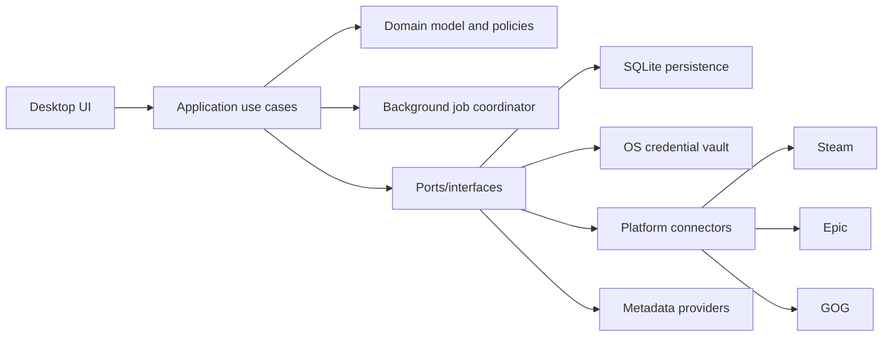

# Architecture

## Proposed stack

| Concern | Provisional choice | Reason |
|---|---|---|
| Language/runtime | Current .NET LTS and C# | Familiar, readable, efficient, mature async/networking/testing ecosystem |
| Desktop UI | Uno Platform using C# Markup, no XAML | Cross-platform .NET with fluent code-defined UI; avoids bundled Chromium and XML |
| UI fallback | Avalonia code-only | Mature desktop focus and full C# UI API if Uno proves unsuitable |
| Persistence | SQLite behind repository interfaces | Local, portable, transactional, inspectable, mature migrations |
| Secrets | OS credential vault through platform adapters | Do not store passwords or raw secrets in SQLite/configuration |
| Background work | Bounded in-process job scheduler initially | Low operational complexity; explicit resource and concurrency budgets |
| Diagnostics | Structured local logs with redaction | Exportable support bundles and opt-in crash reporting |
| Tests | xUnit plus focused integration/UI tooling selected with framework | Strong .NET ecosystem; behavior-first testing |

> [!decision] ADR-001 — Provisional UI framework
> Use Uno Platform with C# Markup for the first vertical slice. Do not create XAML files. Keep domain, application, persistence, and connectors free of Uno references. Reconsider only if a concrete blocker appears in accessibility, desktop performance, packaging, charting, native integration, or maintainability. This is a decision with an exit strategy, not an A/B framework project.

## Why not the familiar .NET alternatives?

- WPF, WinForms, and WinUI 3 are Windows-only.
- .NET MAUI officially targets Windows and macOS desktop but not Linux.
- MAUI Blazor and Tauri use webviews; Tauri does not bundle Chromium, but a web UI/backend split is unnecessary here.
- Avalonia remains credible, but its ecosystem is primarily XAML-oriented even though code-only applications are supported.
- Crystal lacks a comparably mature cross-platform desktop, packaging, secure-storage, and testing ecosystem for this project.

## Logical architecture

Dependencies point inward. The domain layer knows nothing about UI frameworks, SQLite, HTTP, or launcher files.

## Suggested solution boundaries

- `Domain`: entities, value objects, domain events, matching and recommendation policies.
- `Application`: commands/queries, orchestration, authorization boundaries, job definitions.
- `Infrastructure`: SQLite, migrations, HTTP, file parsing, logging, credential-vault adapters.
- `Integrations.*`: one independently testable package per platform/provider.
- `Desktop`: composition root and code-defined UI.
- `Tests.*`: unit, contract, integration, architecture, and UI test projects.

Start with a modular monolith. Do not introduce services, a local HTTP server, message brokers, or plugin loading until a demonstrated need exists.

## Responsiveness budgets

- Render the application shell from cached local data; network is never on the startup critical path.
- Begin optional jobs only after the initial window is interactive.
- Bound CPU, network concurrency, disk writes, and image processing.
- Jobs are cancellable, resumable, idempotent, and checkpointed.
- UI collections virtualize large libraries and load artwork asynchronously.
- Establish measured budgets during the first vertical slice rather than asserting fictional millisecond targets.

## Background job states

`Queued → Running → Paused/Retrying → Completed` or `Failed/Cancelled`.

Every job reports a human-readable action, item counts when knowable, last progress time, retry reason, and safe next action. A spinner alone is never adequate status.

## Distribution direction

Validate Windows first. Later release engineering should produce signed, self-contained installers and automatic update metadata for supported platforms. Packaging is delayed until the product has a stable vertical slice, but filesystem paths and OS services must be abstracted from the beginning.

## Primary references

- [Uno Platform documentation and C# Markup](https://platform.uno/docs/articles/intro.html)
- [Avalonia code-only UI](https://docs.avaloniaui.net/docs/fundamentals/coded-ui)
- [.NET MAUI supported platforms](https://learn.microsoft.com/en-us/dotnet/maui/supported-platforms)
- [Tauri architecture and system webviews](https://v2.tauri.app/concept/architecture/)
